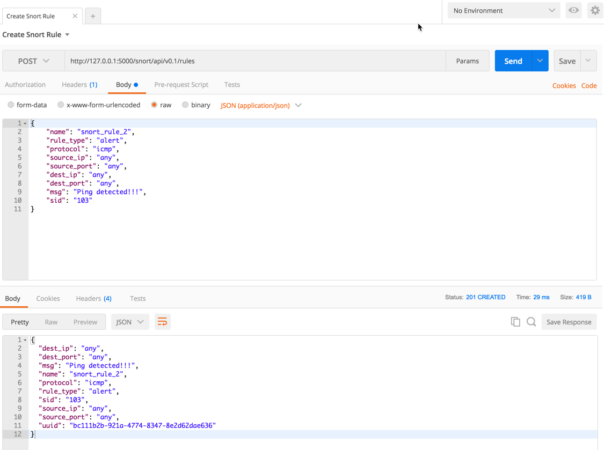

# Snorty-McSnort-Face (Alpha)

### Purpose of Snorty McSort face
* Easy to deploy instance of a Snort Instrusion Detection System (IDS) in a small footprint container.
* Provide a RESTful API to apply snort rules.
* Be able to send alerts to a MQTT message broker for "real-time" message alerting and processing.
* Scale Snort.


>Disclaimer: This is still early stages.  So if you have any suggestions, problems, or requests you would like to see.  Please let me know!

>Note: This also works best on Linux.  I am working on supporting SMSF on the Mac and Windows versions of Docker, that will come along soon.

There is a little bit of configuration required at runtime for environment variables, but is fairly minimal and should get you going pretty quick.

## Requirements

1. Have Docker and Python (Python version 2 or 3 is fine) installed on the computer you are working from.
2. At Least basic knowledge of Python and Docker.
3. Knowledge of building and deploying Docker containers from commandline. 
4. Have a MQTT Broker to send alert messages to and receive alerts from.  Alternatively you can use the [Public Mosquitto MQTT Broker](https://test.mosquitto.org/) on port 1883 as your MQTT broker.
5. Familiarity with [Snort](https://www.snort.org/).
6. Be able to use the [Postman client](https://www.getpostman.com/).
6. Snort rules you want to test.  Please see the postman collection to apply rules via the API.

## Let's get started!!!

Git clone this repo to your computer in a terminal window.
```shell
$ git clone https://github.com/JockDaRock/snorty_mcsnort_face.git
```

Change you current working directory to snorty_mcsnort_face.

```shell
$ cd snorty_mcsnort_face
```

Modify the snort_config.rc file in this directory to account for the envrionments variables of your linux host..

Change the values of MQTT and NETINT to reflect your environment and save the file.  It might look similar to the following:

```
MQTT=your.mqttbroker.org
MQTTPORT=1883
NETINT=eth0
```

Now let's pull the contaner from Docker Hub.

```shell
$ docker pull jockdarock/snorty_mcsnort_face.
```

Before we deploy the container, we will go ahead and run the Python program for the MQTT subcscriber.

In a different terminal window, navigate to the same working directory we are already in and modify line 3 the python file to connect to the MQTT Broker you are using.

```python
MQTT = "test.mosquitto.org"
```

Now that you have modified the file run the following command:

```shell
$ python mqtt_subscriber.py
```

When you are connected you should see a message in the terminal that looks like this:

```shell
$ Connected with result 0
```

For right now, move back to the first terminal window we started with.

Now let's deploy the container using the following command.

>Note: In the deployment of the Docker container we will be using --net=home flag.  This flag will give the Docker container the same network interfaces as the host.  This will give Snort the potential to monitor all traffic to and from the host.  If your host is set in promiscuous mode on your network, it will also give snort the potential to see everything on your network.

```shell
$ docker run -d --net=host --env-file snort_config.rc --name snort_face0 jockdarock/snorty_mcsnort_face
```

Now we will see if snort is working correctly.

Pull up Postman program and import the postman collection from the GitHub repo

Using the Create Snort Rule from the postman collection.  Send a request to create a new rule.



Then use the Restart Snort request from Postman to apply the new rule to Snort.

From the same terminal window we deployed the Docker container in, ping some other network device on your network.

```shell
$ ping 10.0.0.2
PING 10.0.0.2 (10.0.0.2) 56(84) bytes of data.
64 bytes from 10.0.0.2: icmp_seq=1 ttl=64 time=1.81 ms
64 bytes from 10.0.0.2: icmp_seq=2 ttl=64 time=1.90 ms
64 bytes from 10.0.0.2: icmp_seq=3 ttl=64 time=1.53 ms
64 bytes from 10.0.0.2: icmp_seq=4 ttl=64 time=1.57 ms
64 bytes from 10.0.0.2: icmp_seq=5 ttl=64 time=2.16 ms
```

If you go back to terminal window where we have the python service, mqtt_subscriber.py running, you should see something like this being printed to the terminal over and over:

```shell
{"alert_msg": "Ping detected!!!", "src_mac": "00:00:00:00:00:00", "dest_mac": "00:00:00:00:00:00", "ip_type": "IPv4", "src_ip": "10.0.0.2", "dest_ip": "10.0.0.1", "packet_info": {"len": 84, "ttl": 37, "DF": false, "MF": false, "offset": 0}}

```

That's it you are up and running.  Please feel free to put any more Snort rules in place that make sense for your network.  And please let me know what you think about this so far.

### Future

I will be adding the ability to scale and I will also add a more robust DB.

Possibly adding fun services to show what is possible... like [SMS Through Tropo](https://www.tropo.com/) or chat messaging / collaboration through [Cisco Spark](https://developer.ciscospark.com/).


